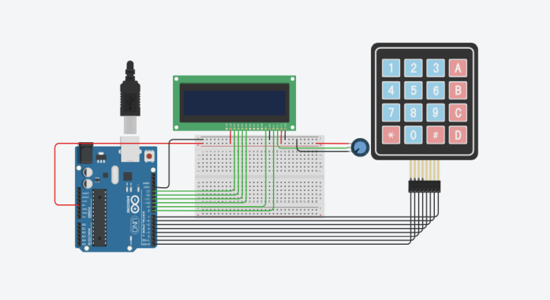

# Arduino Calculator V1.1

# An Arduino Project

it is an arduino code that will allow you to create a number calculator
using integers and handle basic operators ( + \* / - )

## 🎓 Goal achieved

    - [x] Understand of Arduino work inside
    - [x] Handle lcd screen and keypad
    - [x] Add libraries and handle calculations

PS: About the TinkerCard board, you can download and load it in the online [TinkerCard platform](https://www.tinkercad.com/)

### Contributors

<table>
<tr>
    <td align="center" style="word-wrap: break-word; width: 150.0; height: 150.0">
        <a href=https://github.com/Rochdyath>
            
             
            <b>Rochdyath Bachabi</b>
        </a>
    </td>
    <td align="center" style="word-wrap: break-word; width: 150.0; height: 150.0">
        <a href=https://github.com/loictossou2004>
            
             
            <b>Loïc Tossou</b>
        </a>
    </td>
    <td align="center" style="word-wrap: break-word; width: 150.0; height: 150.0">
        <a href=https://github.com/AshTracy>
            
             
            <b>AshleyAvocanh</b>
        </a>
    </td>
    <td align="center" style="word-wrap: break-word; width: 150.0; height: 150.0">
        <a href=https://github.com/yann1508>
            
             
            <b>Yann YAYÏ</b>
        </a>
    </td>
    <td align="center" style="word-wrap: break-word; width: 150.0; height: 150.0">
        <a href=https://github.com/AhRoleo>
            
             
            <b>Roleo AHOTONDJI</b>
        </a>
    </td>
</tr>
</table>

> :star: Goulag!
